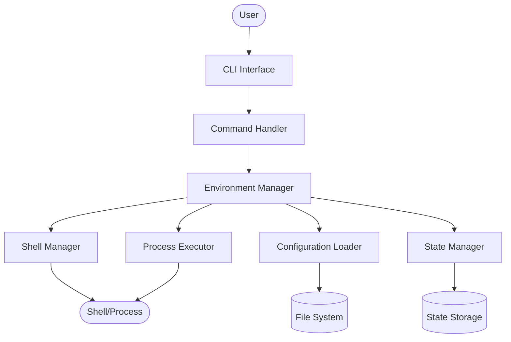

# Stand - Design Document

## 1. Architecture Overview

### 1.1 High-Level Architecture

Stand follows a simple command-line application architecture with clear separation between user interface, business logic, and system interaction layers.



### 1.2 Core Components

- **CLI Interface**: Parses user commands and arguments
- **Command Handler**: Routes commands to appropriate business logic
- **Environment Manager**: Resolves and manages environment variables
- **Configuration Loader**: Reads and validates configuration files
- **Shell Manager**: Handles shell-specific operations and subshell creation
- **State Manager**: Tracks and persists application state
- **Process Executor**: Runs commands with injected environment variables

## 2. Technology Stack

### 2.1 Implementation Language

**Rust** - Chosen for:
- Memory safety without garbage collection
- Fast startup times critical for CLI tools
- Single binary distribution
- Excellent error handling with Result types
- Strong ecosystem for CLI development

### 2.2 Key Dependencies

- **clap** (v4): Command-line argument parsing with derive macros
- **serde** + **serde_yaml**: Configuration file parsing
- **anyhow**: Simplified error handling
- **colored**: Terminal output formatting
- **indexmap**: Order-preserving hash maps for environment variables
- **dirs**: Cross-platform directory paths
- **which**: Shell detection

### 2.3 Build Toolchain

- **cargo**: Build system and package manager
- **rustc**: Rust compiler with optimization flags
- **cross**: Cross-compilation for different platforms

## 3. Data Model

### 3.1 Configuration Structure

```
Configuration
├── version: String
├── environments: Map<String, Environment>
├── common: CommonConfig
└── settings: Settings

Environment
├── description: String
├── extends: Option<String>
├── files: Vec<PathBuf>
├── color: Option<Color>
└── requires_confirmation: bool

Settings
├── default_environment: String
├── nested_shell_behavior: NestedBehavior
└── show_env_in_prompt: bool
```

### 3.2 State Structure

```
State
├── current_environment: Option<String>
├── last_switched: Timestamp
├── session_id: String
├── parent_shell_pid: Option<ProcessId>
└── overrides: Map<String, String>
```

### 3.3 Environment Variables Model

```
EnvironmentVariables
├── base: Map<String, String>      // From common files
├── specific: Map<String, String>  // From environment files
└── session: Map<String, String>   // Runtime overrides
```

## 4. Data Flow

### 4.1 Environment Loading Flow

1. **Configuration Discovery**
   - Search for `.stand/config.yaml` in current directory
   - Validate configuration schema
   - Cache parsed configuration

2. **Variable Resolution**
   - Load common variables if specified
   - Load environment-specific variables
   - Apply session overrides from state
   - Merge in precedence order (later overrides earlier)

3. **Environment Activation**
   - For subshell: Create new shell process with variables
   - For exec: Run command with temporary environment

### 4.2 Subshell Creation Flow

1. Check for existing Stand environment (prevent nesting)
2. Detect user's shell type
3. Prepare environment variables
4. Configure shell-specific prompt
5. Spawn shell process with inherited stdio
6. Wait for shell to exit
7. Clean up state if necessary

### 4.3 Command Execution Flow

1. Parse command and arguments
2. Load specified environment
3. Create child process
4. Inject environment variables
5. Execute command
6. Capture and return exit code

## 5. File System Layout

### 5.1 Project Structure

```
<project-root>/
├── .stand/
│   ├── config.yaml         # Main configuration
│   └── state.json         # Runtime state
├── .stand.common.env      # Base variables
├── .stand.<env>.env       # Environment-specific variables
└── .gitignore            # Auto-updated with stand files
```

### 5.2 User Configuration

```
~/.config/stand/           # Future: Global configuration
└── config.yaml           # Future: User preferences
```

## 6. Command Processing

### 6.1 Command Routing

```
CLI Input → Parser → Command Enum → Handler Function → Result
```

Commands map to distinct handlers:
- `init` → Initialize configuration
- `shell` → Create subshell
- `exec` → Execute command
- `list` → Display environments
- `show` → Display variables
- `switch` → Change default
- `set/unset` → Modify variables
- `validate` → Check configuration
- `current` → Show active environment

### 6.2 Error Handling Strategy

All errors bubble up through Result types with context:
1. Parse errors → Show usage help
2. Configuration errors → Show validation details
3. Environment errors → List available options
4. System errors → Provide troubleshooting steps

## 7. Shell Integration

### 7.1 Shell Detection

1. Read `$SHELL` environment variable
2. Extract shell name from path
3. Map to known shell type
4. Fall back to generic POSIX behavior

### 7.2 Prompt Customization

Each shell requires different prompt syntax:
- **Bash**: Uses `PS1` with escape sequences
- **Zsh**: Uses `PROMPT` with percent codes
- **Fish**: Uses `fish_prompt` function

### 7.3 Environment Isolation

Subshells provide complete isolation:
- Parent environment unchanged
- No variable leakage
- Clean exit restores original state
- Process tree independence

## 8. Security Design

### 8.1 File Permissions

- Check and warn for world-readable sensitive files
- Enforce 0600 permissions on state files
- Validate ownership of configuration files

### 8.2 Variable Handling

- Never log sensitive values
- Sanitize error messages
- No variables in command history
- Clear memory after use

### 8.3 Git Integration

Automatically maintain `.gitignore`:
- Add `.stand/state.json`
- Add `.stand.*.env` patterns
- Preserve existing entries

## 9. Performance Considerations

### 9.1 Optimization Strategies

- **Lazy Loading**: Parse files only when needed
- **Caching**: Keep configuration in memory during session
- **Minimal Allocations**: Reuse buffers where possible
- **Parallel I/O**: Load multiple env files concurrently

### 9.2 Binary Size Optimization

- Link-time optimization (LTO)
- Strip symbols in release builds
- Optimize for size (`opt-level = "z"`)
- Single codegen unit

## 10. Testing Strategy

### 10.1 Test Layers

1. **Unit Tests**: Individual functions and modules
2. **Integration Tests**: Component interactions
3. **End-to-End Tests**: Full command workflows
4. **Shell Tests**: Shell-specific behavior

### 10.2 Test Coverage Areas

- Configuration parsing and validation
- Variable resolution precedence
- Shell detection and prompt formatting
- Subshell creation and cleanup
- Command execution and exit codes
- Error handling and recovery

## 11. Platform Support

### 11.1 Operating Systems

- Linux (glibc 2.17+)
- macOS (10.13+)
- WSL2 (Windows Subsystem for Linux)

### 11.2 Architectures

- x86_64
- aarch64 (ARM64)

### 11.3 Shell Compatibility

Shells with version requirements:
- Bash 4.0+
- Zsh 5.0+
- Fish 3.0+

## 12. Distribution

### 12.1 Release Artifacts

- Static binaries per platform/architecture
- Compressed archives (.tar.gz, .zip)
- Checksums file (SHA256)
- Installation script

### 12.2 Installation Methods

1. **Direct Download**: GitHub releases
2. **Package Managers**: Cargo, Homebrew
3. **From Source**: `cargo install`

## 13. Monitoring and Diagnostics

### 13.1 Debug Mode

Environment variable `STAND_DEBUG=1` enables:
- Verbose logging
- Configuration dump
- Variable resolution trace
- Shell detection details

### 13.2 Health Checks

- Configuration validation
- State file integrity
- Shell compatibility
- File permissions

## 14. Upgrade Path

### 14.1 Version Migration

- Configuration version field for compatibility
- Automatic migration for minor versions
- Manual migration guide for major versions

### 14.2 Backward Compatibility

- Support previous configuration format for one major version
- Clear deprecation warnings
- Migration commands available

## 15. Extension Points

### 15.1 Future Extensibility

Designed to support future additions:
- Custom variable sources (vault, cloud)
- Hook system (pre/post switch)
- Plugin architecture
- Additional shell support
- Template engine for variables

### 15.2 Configuration Extensions

Reserved configuration namespaces:
- `plugins:` for future plugin system
- `hooks:` for lifecycle hooks
- `templates:` for variable templating
- `sources:` for external variable sources

